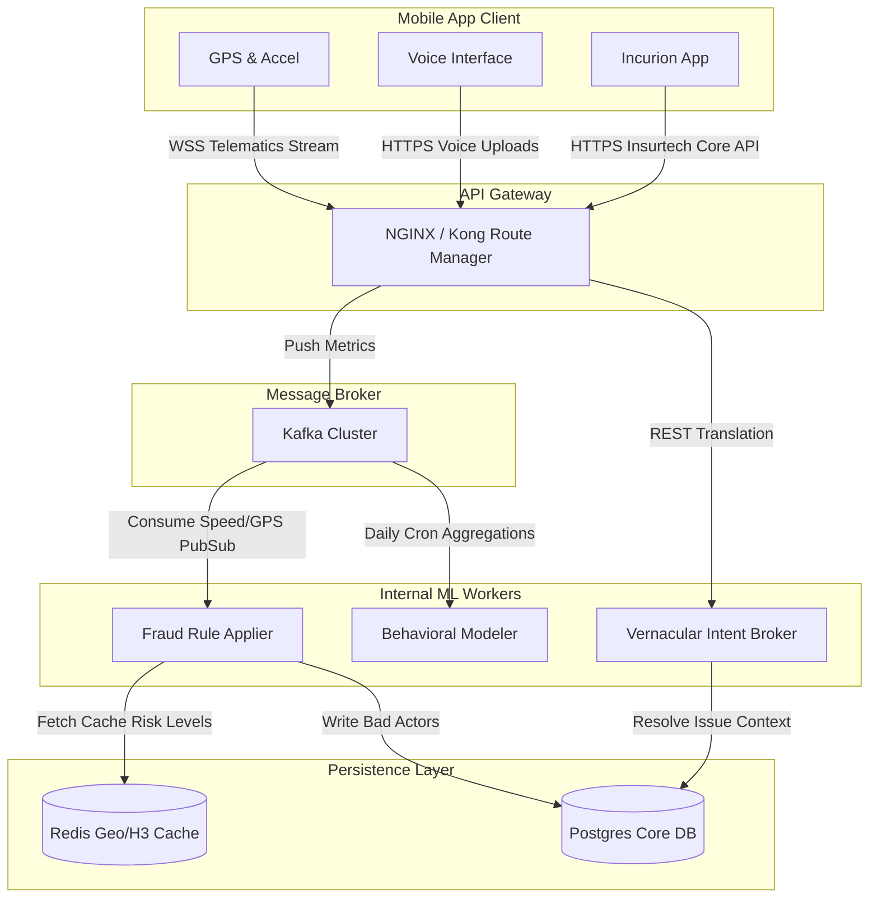

# Incurion Platform Upgrade: Advanced Modules Implementation Plan

This document outlines the architectural design and implementation strategies for resolving critical production gaps in the **Incurion** parametric insurance platform. The modules described are designed for a 3-month production runway.

## 1. Fraud Detection Engine (CRITICAL)

To prevent sophisticated fraud like GPS spoofing and coordinated claim syndicates, we require a multi-layered verification system.

### Core Strategies
*   **GPS Spoofing Detection**: Checking Android's `isMockLocation` flag, verifying altitude variability, and calculating GPS jumps.
*   **Velocity Anomaly**: Enforcing physical constraints (e.g., maximum km/h for a 2-wheeler).
*   **Sensor Fusion**: Using accelerometer data to validate physical movement against GPS deltas.
*   **Device Integrity**: Using Google Play Integrity API to block rooted/jailbroken devices at the payload/authentication layer.

> [!WARNING]
> Coordinated fraud attacks (syndicates) often use multiple devices traveling in parallel. To prevent this, check `trip_id` clusters in PostgreSQL/PostGIS where `(Haversine(d1, d2) < 5m)` holding over `10+` minutes.

### Implementation: Rule-Based + ML Hybrid Scoring

```python
from pydantic import BaseModel
from typing import List
from datetime import datetime
import numpy as np

class TelemetryPoint(BaseModel):
    user_id: str
    timestamp: datetime
    lat: float
    lon: float
    speed_kmh: float
    is_mock_location: bool
    accel_x: float
    accel_y: float
    accel_z: float

def haversine_distance(lat1: float, lon1: float, lat2: float, lon2: float) -> float:
    # standard haversine calculation returning distance in meters
    # omitted to keep logic concise
    return 0.0

def evaluate_fraud_stream(stream: List[TelemetryPoint]) -> dict:
    flags = []
    
    # 1. Device Mock Location Check
    if any(p.is_mock_location for p in stream):
        flags.append("MOCK_LOCATION_DETECTED")
        
    # 2. Kinematic Velocity Check
    for i in range(1, len(stream)):
        dist_m = haversine_distance(stream[i-1].lat, stream[i-1].lon, stream[i].lat, stream[i].lon)
        time_diff_s = (stream[i].timestamp - stream[i-1].timestamp).total_seconds()
        
        if time_diff_s > 0 and (dist_m / time_diff_s) > 33.3: # > 120 km/h is unrealistic
            flags.append("IMPOSSIBLE_VELOCITY")
            break
            
    # 3. Sensor Fusion Analysis 
    # Validates if phone is physically moving while GPS coordinates shift
    accel_var = np.var([p.accel_z for p in stream])
    gps_var = np.var([p.lat for p in stream]) + np.var([p.lon for p in stream])
    
    if gps_var > 1e-5 and accel_var < 0.1:
        flags.append("STATIC_DEVICE_SPOOFING_GPS")
        
    fraud_score = min(len(flags) * 0.35, 1.0)
    action = "BLOCK" if fraud_score > 0.7 else ("FLAG_MANUAL" if fraud_score > 0 else "APPROVE")
    
    return {"score": fraud_score, "flags": flags, "action": action}
```

## 2. Hyperlocal Risk Engine

Moving beyond static zone definitions, we adopt Uber's **H3 Hexagonal Grid** system. Resolution 9 (~0.1 sq km) provides granular street-level risk intelligence at a scale manageable by cache systems.

### Core Strategies
*   **H3 Spatial Indexing**: Translating floating point lat/lon coordinates directly into hashed hex IDs for O(1) lookups.
*   **External Real-Time Overlays**: Applying multipliers based on AccuWeather, Google Traffic, and historical crime data per hex.
*   **Caching Strategy**: Compute micro-zone score every 10 minutes over background workers; UI fetches via Redis `GET`.

### Implementation: Dynamic H3 Caching

```python
import h3
import redis
import json

redis_client = redis.Redis(host='localhost', port=6379, db=0)

def compute_hyperlocal_risk(lat: float, lon: float, external_apis: dict) -> float:
    # 1. Standardize location to H3 Resolution 9 (City block level)
    h3_idx = h3.geo_to_h3(lat, lon, 9)
    
    # 2. Fast Read-Through Cache in Redis
    cached_risk = redis_client.get(f"risk:h3:{h3_idx}")
    if cached_risk:
        return json.loads(cached_risk)['composite_score']
        
    # 3. Fallback Computation (Simulated real-time API integrations)
    base_risk = 1.0
    weather_factor = 1.5 if external_apis.get('rain_mm', 0) > 10 else 1.0
    traffic_factor = 1.3 if external_apis.get('congestion_index', 0) > 0.8 else 1.0
    
    # Aggregate Risk Score
    composite = base_risk * weather_factor * traffic_factor
    
    # 4. Write-through Cache (Expires in 10 minutes)
    redis_client.setex(
        f"risk:h3:{h3_idx}", 
        600, 
        json.dumps({"h3_index": h3_idx, "composite_score": composite})
    )
    return composite
```

## 3. Behavioral Risk Model (Personalization)

Driver base rates are uniformly adjusted using individual driving behavior metrics recorded through background app state.

### Core Strategies
*   **Feature Engineering**: Quantify telemetry into standardized ratios (hard braking events per KM, time spent speeding vs total trip time).
*   **Pricing Impact**: `Premium = Zone Base * Hyperlocal_Multiplier * (1 + Behavioral_Risk_Adjustment)`.
*   **Model Selection**: XGBoost Classifier. Exceptionally stable for tabular datasets with non-linear correlations and missing features.

### Implementation: Feature Engineering & Traning Logic

```python
import pandas as pd
import xgboost as xgb
from sklearn.model_selection import train_test_split

def extract_behavioral_features(raw_trips_df: pd.DataFrame) -> pd.DataFrame:
    # Aggregate 30-day trailing behavior
    features = raw_trips_df.groupby('user_id').agg({
        'sharp_braking_events': 'sum',
        'speeding_duration_mins': 'sum',
        'total_distance_km': 'sum',
        'claims_filed': 'sum'
    })
    
    # Normalize per Trip KM 
    features['hard_brake_per_km'] = features['sharp_braking_events'] / features['total_distance_km']
    features['speeding_ratio'] = features['speeding_duration_mins'] / features['total_distance_km'] 
    
    return features.fillna(0)

def train_driver_risk_model(features_df: pd.DataFrame, target_df: pd.DataFrame):
     data = features_df.join(target_df)
     X = data[['hard_brake_per_km', 'speeding_ratio']]
     y = data['had_claim_90d'] # Binary target parameter
     
     X_train, X_test, y_train, y_test = train_test_split(X, y, test_size=0.2)
     
     # Use calibrated XGBoost with monotonic constraints 
     # (Forces the logic: more braking always maps to natively higher risk)
     model = xgb.XGBClassifier(
         objective='binary:logistic', 
         eval_metric='auc',
         monotone_constraints="(1, 1)" 
     )
     model.fit(X_train, y_train)
     
     return model
```

## 4. Accessibility & Vernacular AI Layer

Delivery networks rely on gig workers heavily using mother tongues. The interface shifts from form-first to voice-first.

### Core Strategies
*   **External APIs**: Implement Azure AI Speech or the Govt API **Bhashini** designed specifically for low-latency Indic translation (Hindi, Tamil, Telugu).
*   **Pipeline Architecture**: Hardware Voice input -> STT API -> LLM Prompt for Intent Recognition -> Action Node -> Vernacular translation string generated -> User TTS.

> [!TIP]
> Keep mobile front ends visually sparse. "Tap & Report issue" voice cards should encompass 70% of the active support screen.

### Implementation: Gateway Integration Example 

```python
import requests

def handle_vernacular_claim(audio_bytes: bytes, user_lang_code: str):
    # 1. Indic Speech to Text Integration
    stt_endpoint = f"https://api.bhashini.gov.in/v1/stt/{user_lang_code}"
    # stt_response = requests.post(stt_endpoint, files={"audio": audio_bytes}).json()
    translated_english_query = "I fell from my bike on MG road." # Example extracted content
    
    # 2. Intent Parsing using an LLM / NLP Layer
    # Output schema expectation: {"intent": "ACCIDENT", "needs_ambulance": False}
    intent_data = extract_intent_via_llm(translated_english_query)
    
    # 3. Backend Adjudication
    if intent_data["intent"] == "ACCIDENT":
        trigger_emergency_protocol(user_id=123)
        english_reply = "We have registered the accident report. An agent is calling you shortly."
    else:
        english_reply = "Your report is logged successfully."
        
    # 4. Localization and Text to Speech Conversion
    # translated_reply = call_translate_api(english_reply, target=user_lang_code)
    # audio_blob = requests.post(tts_endpoint, json={"text": translated_reply})
    
    return {"status": "SUCCESS", "audio_buffer": "<binary_audio_data>"}
```

## 5. System Integration

To ensure the system scales efficiently alongside high concurrency, telemetry processing pipelines are decoupled from the synchronous HTTP layer via Event Busses.

### Architecture Topology



### Performance Optimization Goals
*   **Latency Check**: Fraud verification happens *at the claim submission API path*, ensuring sub-500ms response thresholds by parallelizing checks.
*   **Load Balancing**: Sensor stream ingestors are completely isolated from standard web traffic via Dedicated WebSocket gateways.
*   **Scalability**: Microservices (specifically `Vernacular Service` and `Fraud Node`) are containerized to horizontally auto-scale reacting to Kafka Topic lags.
